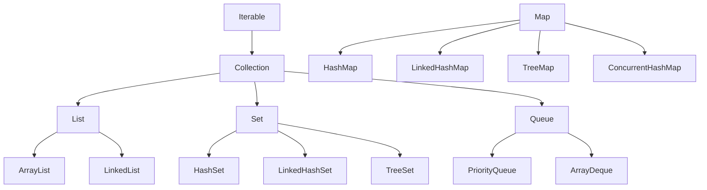

# 03 - Collections và Generics chuyên sâu

⬅️ [[02 - OOP, SOLID và Design Pattern]] | [[00 - Lộ trình Senior 1|Mục lục]] | [[04 - Stream, Exception, I-O và Date-Time]] ➡️

## 1. Generics

### Type erasure

Generics chỉ tồn tại lúc **biên dịch**; lúc chạy, `List<String>` và `List<Integer>` đều là `List`.

Hệ quả:
- Không `new T()`, không `new T[10]`, không `instanceof List<String>`
- Không overload `void f(List<String>)` và `void f(List<Integer>)`
- Có thể gặp *heap pollution* khi dùng raw type

### Wildcard và PECS

**P**roducer **E**xtends, **C**onsumer **S**uper.

```java
// Producer: chỉ ĐỌC từ danh sách -> extends
double sum(List<? extends Number> nums) {
    double s = 0;
    for (Number n : nums) s += n.doubleValue();
    return s;
}

// Consumer: chỉ GHI vào danh sách -> super
void addIntegers(List<? super Integer> target) {
    target.add(1);
    target.add(2);
}
```

| Cú pháp | Ý nghĩa | Đọc | Ghi |
|---------|---------|:---:|:---:|
| `List<? extends T>` | Kiểu con của T | ✅ | ❌ |
| `List<? super T>` | Kiểu cha của T | ❌ (chỉ Object) | ✅ |
| `List<?>` | Kiểu bất kỳ | ✅ (Object) | ❌ |

### Bounded type

```java
static <T extends Comparable<? super T>> T max(Collection<? extends T> c) {
    Iterator<? extends T> it = c.iterator();
    T best = it.next();
    while (it.hasNext()) {
        T cur = it.next();
        if (cur.compareTo(best) > 0) best = cur;
    }
    return best;
}
```

## 2. Bản đồ Collections



`Map` **không** kế thừa `Collection`.

## 3. Độ phức tạp

| Cấu trúc | get/contains | add | remove | Ghi chú |
|----------|:-----------:|:---:|:------:|---------|
| `ArrayList` | O(1) theo chỉ số, O(n) tìm | O(1) amortized | O(n) | Nhanh nhờ cache locality |
| `LinkedList` | O(n) | O(1) ở hai đầu | O(1) nếu có node | Hiếm khi tốt hơn `ArrayList` |
| `HashMap/HashSet` | O(1) trung bình | O(1) | O(1) | Không thứ tự |
| `LinkedHashMap` | O(1) | O(1) | O(1) | Giữ thứ tự thêm vào, dùng làm LRU |
| `TreeMap/TreeSet` | O(log n) | O(log n) | O(log n) | Cây đỏ-đen, có thứ tự |
| `PriorityQueue` | O(1) peek | O(log n) | O(log n) | Heap |
| `ArrayDeque` | | O(1) hai đầu | O(1) | Thay `Stack` và `LinkedList` làm queue |

> [!tip]
> Mặc định chọn `ArrayList`, `HashMap`, `HashSet`, `ArrayDeque`. Chỉ đổi khi có lý do đo được.

## 4. HashMap bên trong

Câu hỏi phỏng vấn kinh điển. Cần nắm:

1. Mảng các **bucket** (kích thước luỹ thừa của 2, mặc định 16).
2. `index = (n - 1) & hash` với `hash = h ^ (h >>> 16)` (trộn bit cao xuống thấp để giảm va chạm).
3. Va chạm: các node trong bucket nối thành **danh sách liên kết**; khi một bucket có **≥ 8** node và bảng đủ lớn (≥ 64) thì chuyển thành **cây đỏ-đen** (O(log n)).
4. **Load factor 0.75**: khi số phần tử vượt `capacity * 0.75` thì **resize gấp đôi** và phân phối lại.
5. Key `null` được phép (một lần); `Hashtable` và `ConcurrentHashMap` thì không.

```java
// Chỉ định capacity ban đầu khi biết trước số phần tử để tránh resize
int expected = 1000;
Map<String, User> map = new HashMap<>((int) (expected / 0.75f) + 1);
// Java 19+: HashMap.newHashMap(expected)
```

> [!danger] Key phải bất biến
> Nếu thay đổi field tham gia `hashCode` sau khi đã đưa vào map, bạn sẽ không tìm lại được phần tử. Dùng `String`, `Long`, `record` bất biến làm key.

## 5. Comparable và Comparator

```java
record Employee(String name, int age, double salary) {}

List<Employee> list = new ArrayList<>();
list.sort(Comparator.comparing(Employee::salary).reversed()
                    .thenComparing(Employee::name));

// Xử lý null
list.sort(Comparator.comparing(Employee::name,
          Comparator.nullsLast(Comparator.naturalOrder())));
```

- `Comparable<T>`: thứ tự **tự nhiên**, cài trong lớp (`compareTo`).
- `Comparator<T>`: thứ tự **tùy biến**, bên ngoài lớp.
- `compareTo` nên nhất quán với `equals`, nếu không `TreeSet` và `HashSet` sẽ cho kết quả khác nhau.

## 6. Collection bất biến, view và fail-fast

```java
List<String> a = List.of("x", "y");            // bất biến, không cho null
List<String> b = Collections.unmodifiableList(src); // VIEW, thay đổi src vẫn thấy
List<String> c = List.copyOf(src);             // bản sao bất biến thật sự

List<Integer> nums = new ArrayList<>(List.of(1, 2, 3, 4));
// SAI: ConcurrentModificationException
for (Integer n : nums) if (n % 2 == 0) nums.remove(n);
// ĐÚNG
nums.removeIf(n -> n % 2 == 0);
```

Iterator của `ArrayList`/`HashMap` là **fail-fast** (dò `modCount`), chỉ mang tính cố gắng, **không** phải cơ chế đồng bộ.

## 7. Collections đa luồng

| Loại | Mô tả |
|------|-------|
| `ConcurrentHashMap` | Khóa mịn theo bucket/CAS; hỗ trợ `compute`, `merge` nguyên tử |
| `CopyOnWriteArrayList` | Ghi sao chép toàn mảng; hợp khi đọc nhiều, ghi rất ít |
| `BlockingQueue` | Producer-consumer: `ArrayBlockingQueue`, `LinkedBlockingQueue` |
| `Collections.synchronizedXxx` | Khóa toàn bộ, thường chậm hơn |

```java
ConcurrentHashMap<String, LongAdder> counts = new ConcurrentHashMap<>();
counts.computeIfAbsent("page", k -> new LongAdder()).increment();

Map<String, Integer> m = new ConcurrentHashMap<>();
m.merge("a", 1, Integer::sum);   // nguyên tử
```

> [!warning]
> `if (!map.containsKey(k)) map.put(k, v);` trên `ConcurrentHashMap` vẫn là **race condition** (check-then-act). Dùng `putIfAbsent`, `computeIfAbsent`, `merge`. Xem thêm [[05 - Concurrency và Multithreading]].

## 8. Mẹo thực chiến

- Khai báo kiểu theo interface: `List<String> l = new ArrayList<>();`
- Trả về collection rỗng thay vì `null`
- Không đưa collection mutable ra ngoài: trả `List.copyOf` hoặc view bất biến
- `EnumMap` và `EnumSet` rất nhanh khi key là enum
- Phát hiện trùng key khi `Collectors.toMap` (nó ném `IllegalStateException`, xem [[04 - Stream, Exception, I-O và Date-Time]])

> [!question] Tự kiểm tra
> 1. Giải thích PECS bằng một ví dụ.
> 2. HashMap xử lý va chạm và resize như thế nào? Vì sao capacity là luỹ thừa của 2?
> 3. Vì sao `ConcurrentHashMap` không cho phép key hoặc value `null`?
> 4. `List.of` khác `Collections.unmodifiableList` ra sao?

⬅️ [[02 - OOP, SOLID và Design Pattern]] | [[00 - Lộ trình Senior 1|Mục lục]] | [[04 - Stream, Exception, I-O và Date-Time]] ➡️
