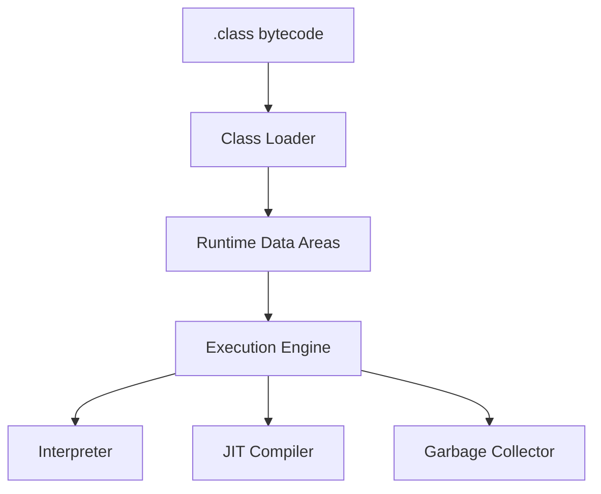

# 06 - JVM, Bộ nhớ và Garbage Collection

⬅️ [[05 - Concurrency và Multithreading]] | [[00 - Lộ trình Senior 1|Mục lục]] | [[07 - Spring Core, IoC và AOP]] ➡️

## 1. Kiến trúc JVM



### Các vùng nhớ

| Vùng | Chứa gì | Ghi chú |
|------|---------|---------|
| **Heap** | Mọi đối tượng, mảng | Chia sẻ giữa các luồng; do GC quản lý |
| **Stack** (mỗi luồng) | Frame của phương thức, biến cục bộ, tham chiếu | `StackOverflowError` khi đệ quy quá sâu |
| **Metaspace** | Metadata lớp (từ Java 8, thay PermGen) | Nằm ngoài heap, dùng bộ nhớ native |
| **Code Cache** | Mã máy do JIT sinh ra | |
| **Direct memory** | `ByteBuffer.allocateDirect`, Netty | Ngoài heap |

## 2. Class Loading

Ba bước: **Loading, Linking (verify, prepare, resolve), Initialization**.

Phân cấp class loader (theo **parent delegation**): Bootstrap, Platform, Application, rồi loader tùy biến. Nạp lớp luôn hỏi cha trước.

> [!note]
> Spring Boot fat jar dùng loader riêng để đọc jar lồng nhau. Lỗi thường gặp: `ClassNotFoundException` (không tìm thấy lúc nạp động) khác `NoClassDefFoundError` (có lúc biên dịch, thiếu lúc chạy, thường do xung đột phiên bản dependency).

## 3. JIT Compiler

JVM khởi đầu bằng **interpreter**, phát hiện "hot code" rồi biên dịch sang mã máy tối ưu (C1 rồi C2, gọi là *tiered compilation*). Tối ưu: inlining, loại bỏ code chết, escape analysis (cấp phát trên stack nếu đối tượng không thoát ra ngoài).

Hệ quả: **ứng dụng chậm lúc khởi động (warm-up)**. Khi benchmark, phải dùng **JMH**, không tự đo bằng `System.nanoTime` một lần.

## 4. Garbage Collection

### Khái niệm

- Đối tượng sống nếu còn **reachable** từ **GC roots** (biến cục bộ trên stack, biến static, luồng đang chạy...).
- **Generational hypothesis**: đa số đối tượng chết trẻ. Heap chia **Young** (Eden + Survivor) và **Old**.
- **Minor GC** dọn Young (nhanh). **Major/Full GC** dọn Old hoặc toàn bộ (chậm hơn).
- **Stop-the-world (STW)**: ứng dụng tạm dừng khi GC làm một số pha.

### Các bộ thu gom

| GC | Đặc điểm | Dùng khi |
|----|----------|----------|
| **G1** (mặc định từ Java 9) | Chia heap thành region, cân bằng thông lượng và độ trễ | Hầu hết ứng dụng server |
| **ZGC** | Độ trễ rất thấp (dưới ms-vài ms), heap lớn; có chế độ generational (Java 21+) | Yêu cầu latency thấp |
| **Shenandoah** | Tương tự ZGC, nén đồng thời | Độ trễ thấp |
| **Parallel** | Tối đa thông lượng, STW dài hơn | Batch |
| **Serial** | Đơn luồng, đơn giản | Container nhỏ, công cụ CLI |

```bash
java -XX:+UseG1GC -Xms2g -Xmx2g -XX:MaxGCPauseMillis=200 -jar app.jar
java -XX:+UseZGC -XX:+ZGenerational -jar app.jar     # Java 21
```

### Các tham số chính

| Tham số | Ý nghĩa |
|---------|---------|
| `-Xms` / `-Xmx` | Heap ban đầu / tối đa (thường đặt **bằng nhau** trên server) |
| `-XX:MaxRAMPercentage=75` | Dùng % RAM của container (nên dùng trong Docker/K8s) |
| `-XX:MaxMetaspaceSize` | Giới hạn Metaspace |
| `-Xss` | Kích thước stack mỗi luồng |
| `-XX:+HeapDumpOnOutOfMemoryError` | Tự dump heap khi hết bộ nhớ |
| `-Xlog:gc*` | Bật log GC |

> [!tip] Trong container
> Đặt `-XX:MaxRAMPercentage` (khoảng 60-75%) thay vì `-Xmx` cứng, và chừa chỗ cho Metaspace, stack, direct memory. Nếu không, pod bị **OOMKilled** dù heap chưa đầy.

## 5. Rò rỉ bộ nhớ và OutOfMemoryError

Java có GC nhưng vẫn **rò rỉ logic**: đối tượng không còn dùng nhưng vẫn bị tham chiếu.

Nguyên nhân hay gặp:
- Cache/Map `static` phình mãi không có giới hạn hoặc TTL
- `ThreadLocal` không `remove()` trong thread pool
- Listener/callback đăng ký mà không hủy
- Kết nối, stream không đóng
- Session lớn, tập kết quả truy vấn không phân trang

| Lỗi | Gợi ý |
|-----|-------|
| `OutOfMemoryError: Java heap space` | Heap đầy: phân tích heap dump |
| `OutOfMemoryError: Metaspace` | Nạp quá nhiều lớp (rò class loader, sinh lớp động) |
| `OutOfMemoryError: unable to create native thread` | Quá nhiều luồng hoặc giới hạn hệ điều hành |
| `GC overhead limit exceeded` | GC tốn gần hết thời gian mà thu được rất ít |

## 6. Công cụ chẩn đoán

```bash
jps                                   # liệt kê tiến trình Java
jcmd <pid> VM.flags                   # xem cờ JVM
jcmd <pid> Thread.print               # thread dump (cũng có jstack)
jcmd <pid> GC.heap_dump /tmp/h.hprof  # heap dump
jstat -gcutil <pid> 1000              # theo dõi GC mỗi giây
jmap -histo <pid> | head              # thống kê đối tượng theo lớp
```

- **JFR (Java Flight Recorder)** + **JDK Mission Control**: profiling nhẹ, dùng được trên production
- **VisualVM**, **async-profiler** (flame graph), **Eclipse MAT** (phân tích heap dump)
- Spring Boot Actuator + Micrometer cho metric JVM (xem [[15 - Observability và Production]])

### Quy trình khi nghi rò bộ nhớ
1. Xem biểu đồ heap sau mỗi GC: có **tăng dần** không?
2. Lấy heap dump ở hai thời điểm, so sánh
3. Mở bằng MAT, tìm "dominator tree" và "path to GC roots"
4. Sửa nguồn giữ tham chiếu, kiểm chứng lại

## 7. Mẹo tối ưu thực tế

- Đo trước, tối ưu sau; phần lớn vấn đề nằm ở **truy vấn DB và I/O**, không phải GC
- Giảm tạo đối tượng tạm trong vòng lặp nóng
- Tránh `String` nối trong vòng lặp; chọn cấu trúc dữ liệu hợp lý
- Class Data Sharing (CDS/AppCDS) và **GraalVM native image** giúp khởi động nhanh, tiết kiệm RAM (đánh đổi: build chậm, hạn chế reflection)
- Java 21 + Spring Boot 3.2+ có thể dùng **CRaC** (checkpoint) ở một số nền tảng

> [!question] Tự kiểm tra
> 1. Phân biệt Heap, Stack, Metaspace. Cái nào gây `StackOverflowError`?
> 2. Giải thích generational hypothesis và vì sao Minor GC nhanh.
> 3. Khi nào chọn G1, khi nào chọn ZGC?
> 4. Pod bị OOMKilled nhưng heap chưa đầy: các nguyên nhân có thể là gì?

⬅️ [[05 - Concurrency và Multithreading]] | [[00 - Lộ trình Senior 1|Mục lục]] | [[07 - Spring Core, IoC và AOP]] ➡️
