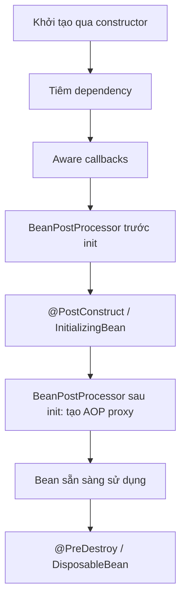
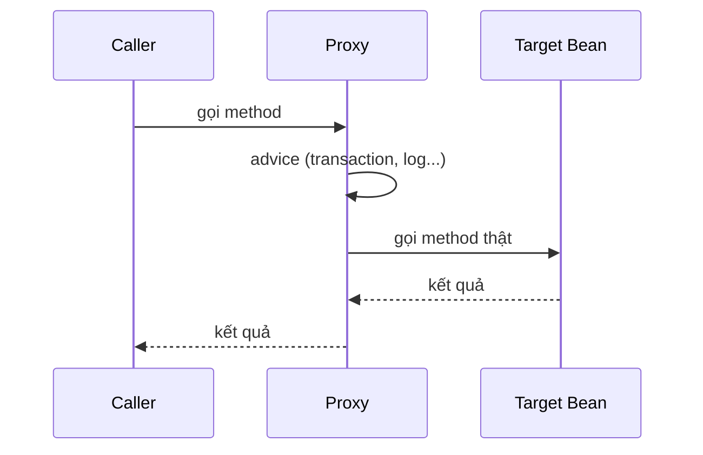

# 07 - Spring Core, IoC và AOP

⬅️ [[06 - JVM, Bộ nhớ và Garbage Collection]] | [[00 - Lộ trình Senior 1|Mục lục]] | [[08 - Spring Boot nội bộ và cấu hình]] ➡️

## 1. IoC và Dependency Injection

- **IoC (Inversion of Control):** framework tạo và quản lý đối tượng thay vì code bạn tự `new`.
- **DI:** framework **tiêm** dependency vào đối tượng cần chúng.
- **ApplicationContext** là container IoC; các đối tượng nó quản lý gọi là **bean**.

Lợi ích: giảm phụ thuộc cứng, dễ test (thay bằng mock), dễ cấu hình theo môi trường. Đây là hiện thực của nguyên tắc D trong [[02 - OOP, SOLID và Design Pattern]].

### Các kiểu tiêm

| Kiểu | Khuyến nghị |
|------|-------------|
| **Constructor** | ✅ Ưu tiên: bất biến (`final`), bắt buộc đủ dependency, dễ test |
| Setter | Chỉ cho dependency tùy chọn |
| Field (`@Autowired` trên field) | ❌ Tránh: khó test, che giấu độ phức tạp |

```java
@Service
public class OrderService {
    private final PaymentGateway gateway;
    private final OrderRepository repo;

    // Một constructor duy nhất: không cần @Autowired
    public OrderService(PaymentGateway gateway, OrderRepository repo) {
        this.gateway = gateway;
        this.repo = repo;
    }
}
```

> [!tip]
> Constructor có quá nhiều tham số (khoảng 5 trở lên) là dấu hiệu lớp làm quá nhiều việc: xem lại **Single Responsibility**.

## 2. Định nghĩa bean

```java
@Component  @Service  @Repository  @Controller  @RestController   // quét tự động

@Configuration
public class AppConfig {
    @Bean
    public Clock clock() { return Clock.systemUTC(); }

    @Bean
    @ConditionalOnMissingBean            // chỉ tạo nếu chưa có bean cùng kiểu
    public ObjectMapper mapper() { return new ObjectMapper(); }
}
```

- `@Component` và các stereotype được phát hiện qua **component scan** (từ package của lớp `@SpringBootApplication`).
- `@Bean` dùng cho lớp **không phải của bạn** (thư viện) hoặc khi cần logic tạo phức tạp.
- `@Configuration` mặc định dùng **CGLIB proxy** để các lời gọi `@Bean` method lẫn nhau vẫn trả về cùng một singleton.

### Chọn bean khi có nhiều ứng viên

```java
@Primary @Service class StripePayment implements PaymentGateway {}
@Service("paypal") class PaypalPayment implements PaymentGateway {}

OrderService(@Qualifier("paypal") PaymentGateway g) { }
OrderService(List<PaymentGateway> all) { }                 // tiêm tất cả
OrderService(Map<String, PaymentGateway> byName) { }       // tiêm theo tên
```

## 3. Vòng đời bean



```java
@Component
class Warmup {
    @PostConstruct void init() { /* sau khi tiêm xong */ }
    @PreDestroy void close() { /* trước khi tắt */ }
}
```

- **`BeanPostProcessor`** là điểm mở rộng quan trọng: AOP, `@Autowired`, `@Async`... đều được xử lý ở đây.
- **`BeanFactoryPostProcessor`** chạy sớm hơn, can thiệp vào *định nghĩa* bean (ví dụ thay `${...}`).

### Scope

| Scope | Ý nghĩa |
|-------|---------|
| `singleton` (mặc định) | Một thể hiện trên mỗi container |
| `prototype` | Mỗi lần yêu cầu tạo mới |
| `request`, `session` | Theo request/phiên web |

> [!danger] Bẫy singleton
> Singleton **dùng chung giữa mọi luồng**. Không giữ trạng thái người dùng/request trong field. Xem [[05 - Concurrency và Multithreading]]. Tiêm bean `prototype` vào singleton chỉ tạo **một lần** trừ khi dùng `ObjectProvider` hoặc `@Lookup`.

### Lazy và phụ thuộc vòng

- `@Lazy`: trì hoãn tạo bean đến lần dùng đầu (giảm thời gian khởi động).
- **Circular dependency** (A cần B, B cần A): Spring Boot 2.6+ **cấm mặc định**. Đừng bật cho qua; hãy tách một thành phần thứ ba hoặc đổi sang sự kiện.

## 4. Sự kiện và cấu hình theo môi trường

```java
record OrderPlaced(long orderId) {}

@Service class Publisher {
    Publisher(ApplicationEventPublisher p) { this.p = p; }
    void place() { p.publishEvent(new OrderPlaced(1L)); }
    private final ApplicationEventPublisher p;
}

@Component class Listener {
    @EventListener void on(OrderPlaced e) { /* đồng bộ, cùng luồng/transaction */ }
    @TransactionalEventListener(phase = TransactionPhase.AFTER_COMMIT)
    void afterCommit(OrderPlaced e) { /* chỉ chạy khi commit thành công */ }
}
```

`@Profile("dev")`, `@ConditionalOnProperty`, `@ConditionalOnClass` điều khiển bean theo môi trường; xem [[08 - Spring Boot nội bộ và cấu hình]].

## 5. AOP (Aspect-Oriented Programming)

Giải quyết các mối quan tâm **cắt ngang** (logging, transaction, bảo mật, cache, đo thời gian) mà không trộn vào nghiệp vụ.

| Thuật ngữ | Nghĩa |
|-----------|-------|
| Aspect | Module chứa logic cắt ngang |
| Join point | Điểm có thể chen vào (ở Spring: lời gọi phương thức) |
| Pointcut | Biểu thức chọn join point |
| Advice | Hành động: `@Before`, `@After`, `@AfterReturning`, `@AfterThrowing`, `@Around` |

```java
@Aspect
@Component
public class TimingAspect {
    @Around("@annotation(Timed)")
    public Object time(ProceedingJoinPoint pjp) throws Throwable {
        long t0 = System.nanoTime();
        try {
            return pjp.proceed();
        } finally {
            log.info("{} mất {} ms", pjp.getSignature(), (System.nanoTime() - t0) / 1_000_000);
        }
    }
}
```

### Proxy: cách AOP hoạt động

Spring bao bean bằng **proxy**:
- **JDK dynamic proxy** khi bean cài đặt interface
- **CGLIB** (tạo lớp con) khi không có interface (mặc định trong Spring Boot)



### Các cái bẫy của proxy (rất hay bị hỏi)

> [!danger] Self-invocation
> Gọi method `@Transactional`/`@Cacheable`/`@Async` **từ trong cùng một lớp** (`this.foo()`) **bỏ qua proxy**, nên annotation không có tác dụng.

```java
@Service
class Svc {
    public void a() { b(); }              // b() KHÔNG chạy trong transaction mới
    @Transactional(propagation = REQUIRES_NEW)
    public void b() { }
}
```

Cách xử lý: tách `b()` sang bean khác (khuyên dùng), hoặc tự tiêm chính proxy.

Các hạn chế khác:
- Method `private`, `final`, `static` không được proxy bằng CGLIB
- Annotation chỉ có hiệu lực trên method `public` được gọi **từ bên ngoài bean**
- Bean phải do Spring tạo (không phải `new`)

## 6. SpEL và Resource

```java
@Value("${app.timeout:5000}")                  // placeholder + giá trị mặc định
private int timeout;

@Cacheable(value = "users", key = "#id", condition = "#id > 0")   // SpEL
User find(long id) { }
```

## 7. Checklist senior

- [ ] Dùng constructor injection, field `final`
- [ ] Hiểu AOP proxy và các bẫy self-invocation
- [ ] Biết thứ tự vòng đời bean và điểm can thiệp
- [ ] Không giữ trạng thái mutable trong singleton
- [ ] Phân biệt `@Component` và `@Bean`
- [ ] Biết dùng `@TransactionalEventListener` để tránh gửi sự kiện trước khi commit

> [!question] Tự kiểm tra
> 1. Vì sao constructor injection được ưu tiên hơn field injection?
> 2. `@Transactional` hoạt động như thế nào bên dưới? Vì sao self-invocation không chạy?
> 3. Khác nhau giữa JDK proxy và CGLIB?
> 4. Spring giải quyết (hay không giải quyết) circular dependency ra sao?

⬅️ [[06 - JVM, Bộ nhớ và Garbage Collection]] | [[00 - Lộ trình Senior 1|Mục lục]] | [[08 - Spring Boot nội bộ và cấu hình]] ➡️
