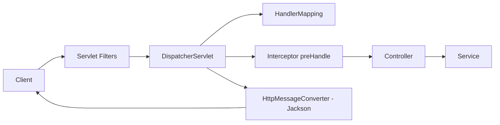

# 09 - Spring MVC và thiết kế REST API

⬅️ [[08 - Spring Boot nội bộ và cấu hình]] | [[00 - Lộ trình Senior 1|Mục lục]] | [[10 - JPA, Hibernate, SQL và Transaction]] ➡️

## 1. Spring MVC xử lý request thế nào



1. **Filter** (mức Servlet): bảo mật, CORS, log, nén. Spring Security nằm ở đây.
2. **DispatcherServlet** tìm handler phù hợp qua `HandlerMapping`.
3. **Interceptor** (`HandlerInterceptor`): trước/sau controller.
4. **Argument resolver** gắn `@PathVariable`, `@RequestBody`... **`HttpMessageConverter`** (Jackson) chuyển JSON qua lại.
5. Lỗi được `@RestControllerAdvice` xử lý tập trung.

| So sánh | Filter | Interceptor | AOP |
|---------|--------|-------------|-----|
| Mức | Servlet | Spring MVC | Bean method |
| Thấy request thô | ✅ | Có handler | ❌ |
| Dùng cho | Security, CORS, log request | Đo thời gian, kiểm tra theo handler | Transaction, cache, audit nghiệp vụ |

## 2. Controller chuẩn

```java
@RestController
@RequestMapping("/api/v1/orders")
@Validated
public class OrderController {

    private final OrderService service;
    public OrderController(OrderService service) { this.service = service; }

    @GetMapping("/{id}")
    public OrderResponse get(@PathVariable long id) { return service.get(id); }

    @GetMapping
    public Page<OrderResponse> list(@RequestParam(required = false) Status status,
                                    @PageableDefault(size = 20) Pageable pageable) {
        return service.list(status, pageable);
    }

    @PostMapping
    public ResponseEntity<OrderResponse> create(@Valid @RequestBody CreateOrderRequest req,
                                                @RequestHeader("Idempotency-Key") String key) {
        OrderResponse created = service.create(req, key);
        return ResponseEntity.created(URI.create("/api/v1/orders/" + created.id())).body(created);
    }

    @DeleteMapping("/{id}")
    @ResponseStatus(HttpStatus.NO_CONTENT)
    public void delete(@PathVariable long id) { service.delete(id); }
}
```

Controller **mỏng**: nhận, kiểm tra, gọi service, trả về. Không chứa nghiệp vụ, không để lộ entity (dùng DTO/record).

## 3. Nguyên tắc thiết kế REST API

### Tài nguyên và URL
- Danh từ số nhiều: `/orders`, `/orders/{id}/items`; không dùng động từ (`/getOrder`)
- Phân cấp nông (tối đa 2 cấp); hành động đặc biệt dùng sub-resource: `POST /orders/{id}/cancel`
- Nhất quán đặt tên (`kebab-case` cho URL, `camelCase` cho JSON)

### Phương thức HTTP

| Method | An toàn | Idempotent | Dùng |
|--------|:------:|:----------:|------|
| GET | ✅ | ✅ | Đọc |
| POST | ❌ | ❌ | Tạo / hành động |
| PUT | ❌ | ✅ | Thay thế toàn bộ |
| PATCH | ❌ | Tùy | Cập nhật một phần |
| DELETE | ❌ | ✅ | Xóa |

### Mã trạng thái

| Mã | Khi nào |
|----|---------|
| 200, 201 (kèm `Location`), 204 | Thành công |
| 400 | Dữ liệu sai định dạng/không hợp lệ |
| 401 | Chưa xác thực |
| 403 | Đã xác thực nhưng không có quyền |
| 404 | Không tồn tại |
| 409 | Xung đột (trùng, sai phiên bản) |
| 422 | Hợp lệ cú pháp nhưng sai nghiệp vụ |
| 429 | Quá giới hạn tần suất |
| 5xx | Lỗi phía server |

### Idempotency (rất quan trọng với thanh toán)

Client có thể **retry** khi timeout. Để `POST` an toàn, nhận header `Idempotency-Key`, lưu kết quả theo khóa (có unique constraint), trả lại kết quả cũ khi gặp lại.

```java
@Transactional
public OrderResponse create(CreateOrderRequest req, String key) {
    return idemRepo.findByKey(key)
        .map(r -> r.response())                       // đã xử lý: trả lại kết quả cũ
        .orElseGet(() -> {
            OrderResponse res = doCreate(req);
            idemRepo.save(new IdempotencyRecord(key, res));  // unique(key) chặn đua nhau
            return res;
        });
}
```

### Phân trang

| Cách | Ưu | Nhược |
|------|----|-------|
| **Offset** (`page`, `size`) | Đơn giản, nhảy trang | Chậm khi offset lớn, lệch dữ liệu khi có chèn |
| **Cursor/Keyset** (`after=id`) | Nhanh, ổn định | Không nhảy trang tùy ý |

```sql
-- Keyset: dùng index, không quét bỏ qua N dòng
SELECT * FROM orders WHERE id < :lastId ORDER BY id DESC LIMIT 20;
```

Luôn **giới hạn `size` tối đa** phía server. Lọc và sắp xếp: whitelist trường được phép.

### Versioning

- Trên URL: `/api/v1/...` (đơn giản, phổ biến)
- Header/media type: `Accept: application/vnd.app.v2+json`
- Ưu tiên **thay đổi tương thích ngược** (thêm trường, không xóa/đổi nghĩa); chỉ tăng version khi bắt buộc; có chính sách **deprecation** (`Deprecation`, `Sunset` header).

### Đồng thời và cache HTTP

- **ETag/If-Match**: khóa lạc quan ở tầng API, trả `412 Precondition Failed` khi sai phiên bản
- **ETag/If-None-Match**, `Cache-Control` cho `GET` cache được

## 4. Validation

```java
public record CreateOrderRequest(
        @NotNull Long customerId,
        @NotEmpty @Size(max = 100) List<@Valid ItemRequest> items,
        @Size(max = 255) String note) {}

public record ItemRequest(@NotNull Long productId, @Positive int quantity) {}
```

- `@Valid` cho `@RequestBody`; `@Validated` ở lớp cho `@PathVariable`/`@RequestParam`
- Ràng buộc tùy biến: tự viết annotation + `ConstraintValidator`
- Kiểm tra **hình thức** ở controller (Bean Validation), **nghiệp vụ** ở service

## 5. Xử lý lỗi thống nhất với ProblemDetail (RFC 9457/7807)

```java
@RestControllerAdvice
class GlobalExceptionHandler extends ResponseEntityExceptionHandler {

    @ExceptionHandler(DomainException.class)
    ProblemDetail domain(DomainException ex) {
        ProblemDetail pd = ProblemDetail.forStatusAndDetail(HttpStatus.UNPROCESSABLE_ENTITY, ex.getMessage());
        pd.setTitle("Lỗi nghiệp vụ");
        pd.setProperty("code", ex.code());
        return pd;
    }

    @ExceptionHandler(OptimisticLockingFailureException.class)
    ProblemDetail conflict(OptimisticLockingFailureException ex) {
        return ProblemDetail.forStatusAndDetail(HttpStatus.CONFLICT, "Dữ liệu đã bị thay đổi, hãy tải lại");
    }

    @ExceptionHandler(Exception.class)
    ProblemDetail unexpected(Exception ex) {
        log.error("Lỗi không mong đợi", ex);           // log đầy đủ ở server
        return ProblemDetail.forStatusAndDetail(HttpStatus.INTERNAL_SERVER_ERROR, "Có lỗi xảy ra");  // KHÔNG lộ chi tiết
    }
}
```

```yaml
spring:
  mvc:
    problemdetails:
      enabled: true
```

Kèm **trace ID** trong phản hồi lỗi để đối chiếu log. Tham khảo [[04 - Stream, Exception, I-O và Date-Time]] về thiết kế exception.

## 6. Serialization với Jackson

```java
public record UserResponse(Long id,
                           String fullName,
                           @JsonFormat(shape = JsonFormat.Shape.STRING) Instant createdAt,
                           @JsonIgnore String internalNote) {}
```

```yaml
spring:
  jackson:
    default-property-inclusion: non_null
    deserialization:
      fail-on-unknown-properties: false
    serialization:
      write-dates-as-timestamps: false
```

Cẩn thận: đừng serialize trực tiếp entity có quan hệ lazy (vòng lặp vô hạn, lộ dữ liệu); dùng DTO.

## 7. CORS, upload, và các điểm hay gặp

```java
@Bean
CorsConfigurationSource cors() {
    CorsConfiguration c = new CorsConfiguration();
    c.setAllowedOrigins(List.of("https://app.example.com"));     // KHÔNG dùng "*" với credentials
    c.setAllowedMethods(List.of("GET", "POST", "PUT", "DELETE"));
    c.setAllowedHeaders(List.of("Authorization", "Content-Type"));
    UrlBasedCorsConfigurationSource s = new UrlBasedCorsConfigurationSource();
    s.registerCorsConfiguration("/api/**", c);
    return s;
}
```

- Upload: giới hạn `spring.servlet.multipart.max-file-size`, kiểm tra loại file, lưu ở object storage thay vì đĩa server
- Tài liệu hóa: **springdoc-openapi** sinh OpenAPI/Swagger; coi OpenAPI là **hợp đồng** (contract-first nếu nhiều team)
- Rate limiting: ở API gateway hoặc dùng Bucket4j/Resilience4j (xem [[13 - Caching, Messaging và Resilience]])
- Client gọi dịch vụ khác: `RestClient` (Spring 6.1+) hoặc declarative HTTP interface, luôn đặt **timeout**

## 8. Checklist API chất lượng

- [ ] DTO riêng, không lộ entity
- [ ] Validation đầu vào, giới hạn kích thước/phân trang
- [ ] Lỗi thống nhất (`ProblemDetail`), không lộ stack trace
- [ ] Idempotency cho thao tác ghi quan trọng
- [ ] Versioning và chính sách tương thích ngược
- [ ] Xác thực/ủy quyền trên mọi endpoint ([[11 - Spring Security, JWT và OAuth2]])
- [ ] Tài liệu OpenAPI luôn đồng bộ
- [ ] Có trace ID, metric, log (xem [[15 - Observability và Production]])

> [!question] Tự kiểm tra
> 1. Khác nhau giữa Filter, Interceptor và AOP? Dùng cái nào cho từng mục đích?
> 2. Vì sao `PUT` là idempotent còn `POST` thì không? Làm sao để `POST` an toàn khi retry?
> 3. So sánh phân trang offset và keyset.
> 4. 401 và 403 khác nhau ra sao? Khi nào trả 409 và 422?

⬅️ [[08 - Spring Boot nội bộ và cấu hình]] | [[00 - Lộ trình Senior 1|Mục lục]] | [[10 - JPA, Hibernate, SQL và Transaction]] ➡️
