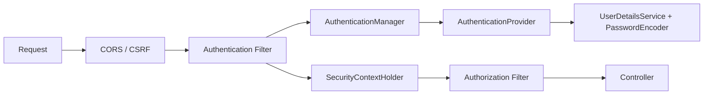

# 11 - Spring Security, JWT và OAuth2

⬅️ [[10 - JPA, Hibernate, SQL và Transaction]] | [[00 - Lộ trình Senior 1|Mục lục]] | [[12 - Testing chuyên sâu]] ➡️

## 1. Khái niệm nền

| Khái niệm | Câu hỏi trả lời |
|-----------|-----------------|
| **Authentication** (xác thực) | Bạn là ai? |
| **Authorization** (phân quyền) | Bạn được làm gì? |
| **Principal** | Danh tính hiện tại |
| **GrantedAuthority** | Quyền/vai trò (`ROLE_ADMIN`, `SCOPE_orders:read`) |

## 2. Kiến trúc Spring Security

Spring Security là một **chuỗi Servlet Filter** (`SecurityFilterChain`) đặt trước `DispatcherServlet`:



- `SecurityContextHolder` giữ `Authentication` của request (dùng `ThreadLocal`, xem [[05 - Concurrency và Multithreading]]).
- Cấu hình hiện đại: **bean `SecurityFilterChain`** (đã bỏ `WebSecurityConfigurerAdapter`).

## 3. Cấu hình cơ bản (API stateless)

```java
@Configuration
@EnableMethodSecurity
public class SecurityConfig {

    @Bean
    SecurityFilterChain api(HttpSecurity http) throws Exception {
        return http
            .csrf(csrf -> csrf.disable())                         // chấp nhận được cho API token, không cookie
            .cors(Customizer.withDefaults())
            .sessionManagement(s -> s.sessionCreationPolicy(SessionCreationPolicy.STATELESS))
            .authorizeHttpRequests(a -> a
                .requestMatchers("/actuator/health/**", "/api/v1/auth/**").permitAll()
                .requestMatchers(HttpMethod.GET, "/api/v1/products/**").permitAll()
                .requestMatchers("/api/v1/admin/**").hasRole("ADMIN")
                .anyRequest().authenticated())
            .oauth2ResourceServer(o -> o.jwt(Customizer.withDefaults()))
            .build();
    }

    @Bean PasswordEncoder passwordEncoder() {
        return PasswordEncoderFactories.createDelegatingPasswordEncoder();   // bcrypt/argon2, có tiền tố thuật toán
    }
}
```

Nguyên tắc: **mặc định từ chối** (`anyRequest().authenticated()` hoặc `denyAll()`), mở từng đường dẫn cụ thể.

### Phân quyền mức method

```java
@PreAuthorize("hasAuthority('SCOPE_orders:write') or #userId == authentication.principal.id")
public Order update(long userId, ...) { }

@PostAuthorize("returnObject.ownerId == authentication.principal.id")
public Order get(long id) { }
```

> [!warning] Phân quyền theo đối tượng
> Kiểm tra vai trò chưa đủ. Lỗi **IDOR/BOLA** (người dùng A đọc đơn của B bằng cách đổi `id`) là lỗi API số 1. Luôn kiểm tra **quyền sở hữu** ở tầng service.

## 4. Lưu mật khẩu

- Băm bằng **bcrypt**, **Argon2** hoặc **scrypt** (có salt, chậm có chủ đích). **Không** MD5/SHA-1/SHA-256 trần.
- `DelegatingPasswordEncoder` cho phép nâng cấp thuật toán dần (`{bcrypt}...`).
- Giới hạn số lần đăng nhập sai, khóa tạm, và/hoặc thêm MFA.

## 5. JWT

Cấu trúc: `header.payload.signature` (Base64URL, **không mã hóa**: ai cũng đọc được payload).

```json
{ "sub": "42", "iss": "https://auth.example.com", "aud": "orders-api",
  "exp": 1790000000, "iat": 1789996400, "scope": "orders:read orders:write" }
```

Cần kiểm tra khi nhận token: **chữ ký**, `exp`, `nbf`, `iss`, `aud`.

| Thuật toán | Ghi chú |
|------------|---------|
| HS256 (đối xứng) | Cùng khóa ký và kiểm tra; mọi dịch vụ giữ bí mật |
| **RS256 / ES256 (bất đối xứng)** | Chỉ auth server giữ khóa riêng; dịch vụ dùng **JWKS** (khóa công khai) để kiểm tra: ưu tiên cho hệ phân tán |

Thực hành tốt:
- **Access token ngắn hạn** (5-15 phút) + **refresh token** dài hạn, **xoay vòng (rotation)**, lưu băm ở server để có thể thu hồi
- Không đặt dữ liệu nhạy cảm vào payload
- Cấm thuật toán `none`; cố định thuật toán mong đợi
- JWT khó **thu hồi tức thì**: giảm hạn dùng, dùng danh sách chặn (denylist) hoặc kiểm tra phiên cho thao tác nhạy cảm
- Lưu ở trình duyệt: ưu tiên cookie `HttpOnly; Secure; SameSite` (chống XSS đánh cắp) hơn `localStorage`; khi dùng cookie thì **CSRF** quay lại là mối lo

## 6. OAuth 2.0 và OpenID Connect

- **OAuth 2.0**: giao thức **ủy quyền** (cấp quyền truy cập tài nguyên).
- **OIDC**: lớp **xác thực** phía trên OAuth2 (thêm `id_token`, thông tin người dùng).

| Vai trò | Ví dụ |
|---------|-------|
| Resource Owner | Người dùng |
| Client | Ứng dụng web/mobile/backend |
| Authorization Server | Keycloak, Auth0, Okta, Azure AD, Spring Authorization Server |
| Resource Server | API của bạn |

### Các luồng (grant)

| Luồng | Dùng cho |
|-------|----------|
| **Authorization Code + PKCE** | Web SPA, mobile, và cả web server (luồng khuyên dùng) |
| **Client Credentials** | Máy gọi máy (service-to-service) |
| Refresh Token | Lấy access token mới |
| ~~Implicit~~, ~~Password~~ | **Đã lỗi thời**, không dùng |

```yaml
# API của bạn là Resource Server
spring:
  security:
    oauth2:
      resourceserver:
        jwt:
          issuer-uri: https://auth.example.com/realms/shop
```

Spring tự tải JWKS từ issuer và kiểm tra chữ ký. Ánh xạ scope/role sang authority qua `JwtAuthenticationConverter`.

> [!tip] Đừng tự viết hệ thống đăng nhập
> Dùng **Keycloak** hoặc nhà cung cấp danh tính có sẵn. Tự làm auth server dễ có lỗ hổng tinh vi.

## 7. CSRF và CORS

- **CSRF** (giả mạo request): chỉ đe dọa khi trình duyệt **tự gửi credential** (cookie/session). API dùng header `Authorization: Bearer` có thể tắt CSRF. Ứng dụng dùng session/cookie thì **bật** CSRF.
- **CORS**: chính sách của **trình duyệt**, không phải bảo mật server. Chỉ cho phép các origin cần thiết; không dùng `*` kèm credentials. Cấu hình ở [[09 - Spring MVC và thiết kế REST API]].

## 8. Bảo mật service-to-service

- **mTLS** trong service mesh (Istio/Linkerd) mã hóa và xác thực giữa dịch vụ
- Hoặc **Client Credentials** với token có `aud` riêng
- Truyền danh tính người dùng qua token (token exchange) thay vì tin header tùy ý

## 9. Checklist bảo mật (OWASP)

- [ ] **Broken Access Control**: kiểm tra quyền sở hữu mỗi truy cập tài nguyên
- [ ] **Injection**: dùng tham số hóa (`PreparedStatement`, JPA param), không nối chuỗi SQL
- [ ] **Cryptographic failures**: HTTPS mọi nơi, băm mật khẩu đúng cách, mã hóa dữ liệu nhạy cảm
- [ ] **Misconfiguration**: tắt endpoint debug/Actuator thừa, header bảo mật (HSTS, CSP, `X-Content-Type-Options`)
- [ ] **Vulnerable components**: quét phụ thuộc (OWASP Dependency-Check, Dependabot, Trivy)
- [ ] **Logging**: log sự kiện đăng nhập/phân quyền, **không** log bí mật
- [ ] **SSRF**: kiểm soát URL do người dùng cung cấp khi gọi ra ngoài
- [ ] **Mass assignment**: dùng DTO riêng, không bind thẳng entity
- [ ] **Rate limiting** và chống brute-force
- [ ] Bí mật nằm ở Secret Manager, không ở git; xoay vòng định kỳ

> [!question] Tự kiểm tra
> 1. Vì sao JWT payload không được chứa dữ liệu nhạy cảm?
> 2. Vì sao hệ phân tán nên dùng RS256/ES256 hơn HS256?
> 3. Authorization Code + PKCE giải quyết vấn đề gì? Khi nào dùng Client Credentials?
> 4. API Bearer token có cần bật CSRF không? Vì sao?
> 5. Mô tả lỗi IDOR/BOLA và cách phòng.

⬅️ [[10 - JPA, Hibernate, SQL và Transaction]] | [[00 - Lộ trình Senior 1|Mục lục]] | [[12 - Testing chuyên sâu]] ➡️
