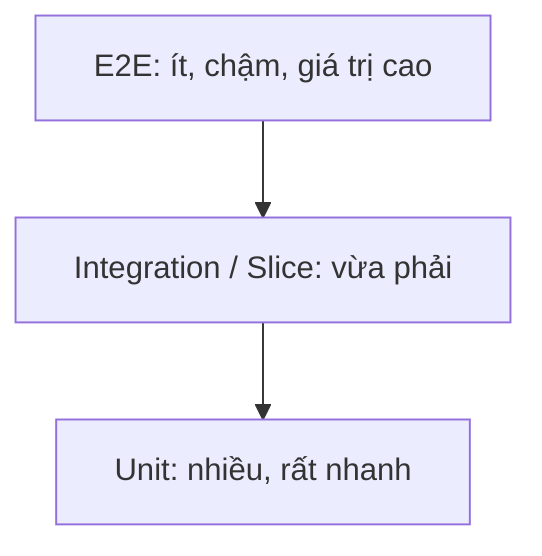

# 12 - Testing chuyên sâu

⬅️ [[11 - Spring Security, JWT và OAuth2]] | [[00 - Lộ trình Senior 1|Mục lục]] | [[13 - Caching, Messaging và Resilience]] ➡️

## 1. Tư duy kiểm thử của senior

- Test là **tài liệu sống** và **lưới an toàn** để refactor, không phải thủ tục.
- Test tốt: **nhanh, độc lập, lặp lại được, tự kiểm tra, có ý nghĩa**.
- Kiểm tra **hành vi** (kết quả quan sát được), không kiểm tra chi tiết cài đặt (tránh test vỡ khi refactor).
- Chất lượng quan trọng hơn con số **coverage**; coverage cao không đồng nghĩa test tốt (xem mutation testing).

## 2. Kim tự tháp kiểm thử



| Loại | Phạm vi | Công cụ |
|------|---------|---------|
| Unit | Một lớp, mock phụ thuộc | JUnit 5, Mockito, AssertJ |
| Slice | Một lát của Spring | `@WebMvcTest`, `@DataJpaTest`, `@JsonTest` |
| Integration | Nhiều thành phần, DB thật | `@SpringBootTest`, Testcontainers |
| Contract | Hợp đồng giữa dịch vụ | Spring Cloud Contract, Pact |
| E2E | Toàn hệ thống | REST Assured, Playwright |

## 3. Unit test

```java
@ExtendWith(MockitoExtension.class)
class OrderServiceTest {

    @Mock OrderRepository repo;
    @Mock PaymentGateway gateway;
    @InjectMocks OrderService service;

    @Test
    @DisplayName("Tạo đơn thất bại khi thanh toán bị từ chối")
    void createFailsWhenPaymentDeclined() {
        when(gateway.charge(any())).thenReturn(PaymentResult.declined());

        assertThatThrownBy(() -> service.create(sampleRequest()))
            .isInstanceOf(PaymentDeclinedException.class)
            .hasMessageContaining("từ chối");

        verify(repo, never()).save(any());
    }

    @ParameterizedTest
    @CsvSource({"0,false", "1,true", "100,true", "101,false"})
    void quantityRule(int qty, boolean valid) {
        assertThat(Rules.validQuantity(qty)).isEqualTo(valid);
    }
}
```

Mẹo:
- Mẫu **Arrange - Act - Assert** (hoặc Given - When - Then); mỗi test một ý chính
- Đặt tên mô tả hành vi, dùng `@DisplayName`
- **AssertJ** cho assertion đọc được; `assertAll` cho nhiều kiểm tra
- Mock **ranh giới** (DB, HTTP, hàng đợi), không mock những thứ đơn giản như DTO hay lớp thuần
- Đừng mock thứ bạn không sở hữu rồi giả định hành vi: kiểm tra bằng integration test
- Inject `Clock`, nguồn ngẫu nhiên để test xác định (xem [[04 - Stream, Exception, I-O và Date-Time]])
- Dùng **Test Data Builder**/Object Mother thay vì dựng đối tượng dài dòng

## 4. Slice test với Spring

### Controller

```java
@WebMvcTest(OrderController.class)
@Import(SecurityConfig.class)
class OrderControllerTest {

    @Autowired MockMvc mvc;
    @MockitoBean OrderService service;      // Boot 3.4+ (trước đó dùng @MockBean)

    @Test
    @WithMockUser(roles = "USER")
    void rejectsInvalidBody() throws Exception {
        mvc.perform(post("/api/v1/orders")
                .contentType(MediaType.APPLICATION_JSON)
                .header("Idempotency-Key", "k1")
                .content("{\"customerId\":null,\"items\":[]}"))
           .andExpect(status().isBadRequest())
           .andExpect(jsonPath("$.title").exists());
    }

    @Test
    void anonymousIsUnauthorized() throws Exception {
        mvc.perform(get("/api/v1/orders/1")).andExpect(status().isUnauthorized());
    }
}
```

### Repository

```java
@DataJpaTest
@AutoConfigureTestDatabase(replace = AutoConfigureTestDatabase.Replace.NONE)   // dùng DB thật qua Testcontainers
@Testcontainers
class OrderRepositoryTest {

    @Container @ServiceConnection
    static PostgreSQLContainer<?> pg = new PostgreSQLContainer<>("postgres:16");

    @Autowired OrderRepository repo;

    @Test
    void findsByStatus() {
        repo.save(new Order(Status.PAID));
        assertThat(repo.findByStatus(Status.PAID)).hasSize(1);
    }
}
```

> [!danger] Đừng dùng H2 thay Postgres/MySQL
> H2 khác hành vi (kiểu dữ liệu, khóa, SQL đặc thù, JSON...) nên test xanh mà production vẫn lỗi. Dùng **cùng loại DB** bằng **Testcontainers**.

## 5. Integration test

```java
@SpringBootTest(webEnvironment = SpringBootTest.WebEnvironment.RANDOM_PORT)
@Testcontainers
class OrderFlowIT {

    @Container @ServiceConnection
    static PostgreSQLContainer<?> pg = new PostgreSQLContainer<>("postgres:16");
    @Container @ServiceConnection
    static KafkaContainer kafka = new KafkaContainer(DockerImageName.parse("apache/kafka:3.7.0"));

    @Autowired TestRestTemplate rest;

    @Test
    void createsOrderAndPublishesEvent() {
        var res = rest.postForEntity("/api/v1/orders", request(), OrderResponse.class);
        assertThat(res.getStatusCode()).isEqualTo(HttpStatus.CREATED);
        // kiểm tra sự kiện bằng Awaitility, không dùng Thread.sleep
        await().atMost(5, SECONDS).untilAsserted(() ->
            assertThat(consumed()).anyMatch(e -> e.orderId().equals(res.getBody().id())));
    }
}
```

Mẹo:
- **Awaitility** cho tác vụ bất đồng bộ; cấm `Thread.sleep`
- Chia sẻ container giữa các lớp test (singleton container / `reuse`) để nhanh hơn
- Giả lập dịch vụ HTTP ngoài bằng **WireMock** hoặc `MockWebServer`
- Dọn dữ liệu giữa các test (`@Transactional` rollback hoặc truncate), tránh test phụ thuộc thứ tự
- Cache context của Spring: tránh `@DirtiesContext` và quá nhiều cấu hình `@MockitoBean` khác nhau (mỗi tổ hợp tạo context mới, làm chậm)

## 6. Test bảo mật và đa luồng

- `@WithMockUser`, `@WithUserDetails`, `jwt()` post-processor của `spring-security-test`
- Kiểm tra cả trường hợp **bị cấm** (401, 403, truy cập tài nguyên của người khác)
- Đa luồng/đồng thời: dùng `ExecutorService` + `CountDownLatch` để bắn request song song, xác nhận chỉ một thành công (khóa lạc quan, unique constraint, idempotency)

## 7. Contract testing (microservices)

Vấn đề: dịch vụ A đổi API làm hỏng B mà không ai biết đến khi triển khai.
- **Consumer-driven contract** (Pact, Spring Cloud Contract): consumer mô tả điều nó cần, provider phải thỏa mãn trong CI.
- Thay thế được phần lớn E2E tốn kém, giúp triển khai độc lập (xem [[14 - Microservices và Distributed Patterns]]).

## 8. Các loại test bổ sung

| Loại | Mục đích |
|------|----------|
| **ArchUnit** | Kiểm tra quy tắc kiến trúc (controller không gọi repository trực tiếp, không có vòng phụ thuộc giữa package) |
| **Mutation testing** (PIT) | Đo chất lượng test bằng cách cố ý "làm hỏng" code |
| **Performance/Load** | Gatling, k6, JMeter: tìm giới hạn trước khi production tìm giúp bạn |
| **Chaos** | Chủ động gây lỗi (mạng, dịch vụ chết) để kiểm tra khả năng chịu lỗi |
| **Test bảo mật** | SAST/DAST, quét phụ thuộc |

```java
@AnalyzeClasses(packages = "com.app")
class ArchitectureTest {
    @ArchTest
    static final ArchRule controllersDontTouchRepos =
        noClasses().that().resideInAPackage("..controller..")
                   .should().dependOnClassesThat().resideInAPackage("..repository..");
}
```

## 9. TDD và CI

- **TDD**: Red (viết test thất bại) → Green (làm cho qua) → Refactor. Rất hợp cho logic nghiệp vụ; không bắt buộc cho mọi thứ.
- Chạy unit test ở mỗi commit, integration test ở mỗi PR; **test flaky** (lúc xanh lúc đỏ) phải sửa hoặc cách ly ngay, nếu không cả đội mất niềm tin vào CI.
- Chia test thành nhóm (`@Tag("integration")`) để chạy song song và theo giai đoạn.

## 10. Checklist

- [ ] Nhiều unit test nhanh, ít E2E
- [ ] Integration test dùng DB/broker thật qua Testcontainers
- [ ] Test cả đường lỗi, biên, quyền truy cập, đồng thời
- [ ] Không `Thread.sleep`, không phụ thuộc thứ tự, không phụ thuộc thời gian thực
- [ ] Có contract test giữa các dịch vụ
- [ ] CI chặn merge khi test đỏ; theo dõi test flaky

> [!question] Tự kiểm tra
> 1. Vì sao nên dùng Testcontainers thay H2?
> 2. Khi nào mock, khi nào dùng thành phần thật?
> 3. `@WebMvcTest` khác `@SpringBootTest` ra sao? Vì sao ưu tiên slice test?
> 4. Làm sao test được rằng hai request đồng thời chỉ một cái thành công?
> 5. Contract test giải quyết vấn đề gì mà unit test không làm được?

⬅️ [[11 - Spring Security, JWT và OAuth2]] | [[00 - Lộ trình Senior 1|Mục lục]] | [[13 - Caching, Messaging và Resilience]] ➡️
