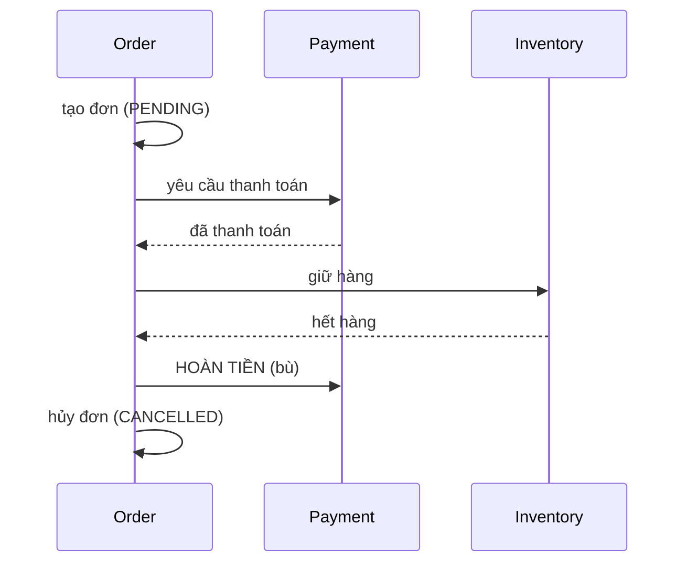

# 14 - Microservices và Distributed Patterns

⬅️ [[13 - Caching, Messaging và Resilience]] | [[00 - Lộ trình Senior|Mục lục]] | [[15 - Observability và Production]] ➡️

## 1. Có nên dùng microservices?

> [!warning] Microservices là đánh đổi, không phải mục tiêu
> Chúng giải quyết vấn đề **tổ chức và mở rộng độc lập**, đổi lại bằng độ phức tạp **phân tán**. Phần lớn hệ thống nên bắt đầu bằng **modular monolith** và tách ra khi có lý do rõ ràng.

| Monolith (modular) | Microservices |
|--------------------|---------------|
| Một đơn vị triển khai, giao dịch ACID dễ | Triển khai/mở rộng độc lập, nhiều team song song |
| Đơn giản vận hành và debug | Cần mạng, quan sát, CI/CD, tự động hóa trưởng thành |
| Nguy cơ "bùn lớn" nếu không có ranh giới | Nguy cơ "monolith phân tán" nếu ranh giới sai |

**Dấu hiệu nên tách:** team lớn dẫm chân nhau, các phần có yêu cầu mở rộng/độ tin cậy khác hẳn, tần suất phát hành khác nhau, ranh giới nghiệp vụ đã ổn định.

## 2. Vẽ ranh giới dịch vụ

- Theo **bounded context** (Domain-Driven Design), không theo tầng kỹ thuật (đừng có "service DB", "service UI")
- Mỗi dịch vụ **sở hữu dữ liệu của nó**: không chia sẻ chung một DB (database per service)
- Gắn kết cao bên trong, ghép nối lỏng bên ngoài; giao tiếp qua **hợp đồng** (API/sự kiện)
- Kiểm tra: một thay đổi nghiệp vụ thường có phải sửa nhiều dịch vụ cùng lúc không? Nếu có, ranh giới sai.

## 3. Giao tiếp giữa dịch vụ

| Kiểu | Công nghệ | Dùng khi |
|------|-----------|----------|
| Đồng bộ | REST, gRPC | Cần kết quả ngay (truy vấn) |
| Bất đồng bộ | Kafka, RabbitMQ | Thông báo sự kiện, tách rời, xử lý nền |

- **gRPC** (Protobuf, HTTP/2): nhanh, hợp đồng chặt, tốt cho nội bộ; REST dễ dùng cho bên ngoài.
- Giảm **coupling thời gian**: chuỗi gọi đồng bộ A→B→C→D nhân xác suất lỗi và độ trễ. Ưu tiên sự kiện khi có thể.
- Mọi lời gọi cần timeout, retry hợp lý, circuit breaker ([[13 - Caching, Messaging và Resilience]]).

## 4. Hạ tầng thường đi kèm

| Thành phần | Vai trò |
|-----------|---------|
| **API Gateway** (Spring Cloud Gateway, Kong, Envoy) | Điểm vào duy nhất: định tuyến, xác thực, rate limit |
| Service discovery | Tìm dịch vụ (Kubernetes DNS đã đảm nhiệm, ít khi cần Eureka) |
| Config tập trung | Spring Cloud Config, ConfigMap/Secret của K8s |
| **Service mesh** (Istio, Linkerd) | mTLS, retry, quan sát ở tầng hạ tầng |
| Distributed tracing | OpenTelemetry (xem [[15 - Observability và Production]]) |

## 5. Định lý CAP và PACELC

Khi **phân vùng mạng (P)** xảy ra, hệ thống phải chọn **Consistency** hoặc **Availability**.
- **CP**: từ chối phục vụ để giữ nhất quán (ví dụ coordination store)
- **AP**: vẫn phục vụ nhưng có thể trả dữ liệu cũ (ví dụ nhiều cache/NoSQL)
- **PACELC**: ngay cả khi *không* phân vùng, vẫn có đánh đổi **Latency vs Consistency**

Hệ quả thực tế: giao dịch xuyên dịch vụ thường chỉ đạt **nhất quán cuối cùng (eventual consistency)**.

## 6. Giao dịch phân tán: Saga

Không có `@Transactional` xuyên nhiều dịch vụ. **Saga** = chuỗi giao dịch cục bộ; nếu một bước hỏng thì chạy các **giao dịch bù (compensating)** để hoàn tác.



| Kiểu | Mô tả | Ưu | Nhược |
|------|-------|----|-------|
| **Choreography** | Mỗi dịch vụ lắng nghe sự kiện rồi phản ứng | Lỏng lẻo, đơn giản khi ít bước | Khó theo dõi luồng tổng thể, dễ rối |
| **Orchestration** | Một bộ điều phối ra lệnh từng bước | Luồng rõ ràng, dễ giám sát | Thêm thành phần điều phối (Temporal, Camunda, Axon) |

Lưu ý thiết kế: bước bù phải **idempotent** và có thể **thử lại**; có trạng thái trung gian (`PENDING`) rõ ràng; hành động không thể bù (gửi email) đặt ở cuối.

## 7. Transactional Outbox

Vấn đề **ghi kép**: lưu DB xong rồi gửi Kafka thì sập ở giữa → mất sự kiện (hoặc ngược lại → sự kiện ma).

Giải pháp: trong **cùng một transaction DB** ghi dữ liệu nghiệp vụ **và** một dòng vào bảng `outbox`; một tiến trình riêng đọc bảng này rồi phát lên broker.

```java
@Transactional
public void placeOrder(Order o) {
    orders.save(o);
    outbox.save(new OutboxEvent(UUID.randomUUID(), "OrderPlaced", toJson(o)));   // cùng transaction
}
```

- **Relay** phát sự kiện: polling bảng `outbox`, hoặc **CDC** (Debezium đọc log DB, tin cậy hơn và độ trễ thấp)
- Đảm bảo **at-least-once** → consumer phải **idempotent**
- Dọn bảng outbox định kỳ

Cặp đôi: **Inbox pattern** ở phía nhận (bảng `processed_messages`) để khử trùng.

## 8. CQRS và Event Sourcing

**CQRS**: tách mô hình **ghi (command)** và **đọc (query)**; mô hình đọc có thể là bảng/index/cache riêng được cập nhật từ sự kiện, tối ưu truy vấn.
- Dùng khi tải đọc/ghi khác hẳn nhau hoặc cần nhiều "góc nhìn" dữ liệu. Phiên bản nhẹ: JPA cho ghi, SQL/jOOQ cho đọc ([[10 - JPA, Hibernate, SQL và Transaction]]).

**Event Sourcing**: lưu **chuỗi sự kiện** thay vì trạng thái hiện tại; trạng thái = phát lại sự kiện.
- Ưu: lịch sử/kiểm toán đầy đủ, dựng lại bất kỳ thời điểm nào. Nhược: phức tạp (tiến hóa schema sự kiện, truy vấn, snapshot). **Đừng dùng mặc định.**

## 9. Các mẫu khác đáng biết

| Mẫu | Ý tưởng |
|-----|---------|
| **Strangler Fig** | Di chuyển dần từ monolith: bao quanh, thay từng phần |
| **Backend for Frontend (BFF)** | Mỗi loại client có một API gateway riêng |
| **API Composition** | Gateway/dịch vụ gom dữ liệu từ nhiều dịch vụ |
| **Sidecar** | Tiện ích đi kèm container (proxy, log) |
| **Anti-Corruption Layer** | Lớp dịch giữa hệ thống cũ và mô hình mới |
| **Leader election, Distributed lock** | Chọn một tiến trình làm việc duy nhất (ShedLock, Redis, ZooKeeper/etcd) |
| **Idempotent Receiver** | Khử trùng thông điệp |

### Khóa phân tán: cẩn thận

Khóa Redis (`SET NX PX`) không tuyệt đối an toàn khi có GC pause/lệch đồng hồ. Dùng **fencing token** hoặc dựa vào ràng buộc DB (unique, khóa lạc quan) cho tính đúng đắn; khóa phân tán chỉ để giảm công việc trùng lặp. Với job định kỳ nhiều instance, dùng **ShedLock**.

## 10. Phiên bản hóa và tiến hóa hợp đồng

- Thêm trường tùy chọn, không xóa/đổi nghĩa (tương thích ngược và xuôi)
- Sự kiện: dùng **schema registry** (Avro/Protobuf) để kiểm soát tiến hóa
- Triển khai **độc lập** đòi hỏi consumer chịu được cả hai phiên bản trong lúc chuyển giao; kết hợp **contract test** ([[12 - Testing chuyên sâu]])

## 11. Sự cố thường gặp trong microservices

- **Monolith phân tán**: dịch vụ phải triển khai cùng nhau, gọi đồng bộ chằng chịt
- **Chatty services**: quá nhiều lời gọi nhỏ → độ trễ cao
- **Chia sẻ database**: ghép nối ngầm
- **Thiếu quan sát**: không lần ra request đi qua đâu
- **Không có chuẩn chung**: mỗi team một kiểu log/metric/lỗi

## 12. Checklist

- [ ] Có lý do rõ ràng để tách; ranh giới theo bounded context
- [ ] Mỗi dịch vụ sở hữu dữ liệu riêng
- [ ] Giao tiếp có timeout, circuit breaker, idempotency
- [ ] Giao dịch xuyên dịch vụ dùng Saga + Outbox, không "2PC cố"
- [ ] Hợp đồng được versioning và có contract test
- [ ] Có tracing, metric, log tương quan ([[15 - Observability và Production]])

> [!question] Tự kiểm tra
> 1. Khi nào nên giữ modular monolith thay vì microservices?
> 2. Giải thích vấn đề ghi kép và cách Outbox giải quyết.
> 3. So sánh Saga choreography và orchestration.
> 4. CAP/PACELC nói gì về hệ thống của bạn? Ví dụ chọn CP hay AP cho một tính năng cụ thể.
> 5. Vì sao khóa phân tán không đủ để đảm bảo tính đúng đắn?

⬅️ [[13 - Caching, Messaging và Resilience]] | [[00 - Lộ trình Senior|Mục lục]] | [[15 - Observability và Production]] ➡️
