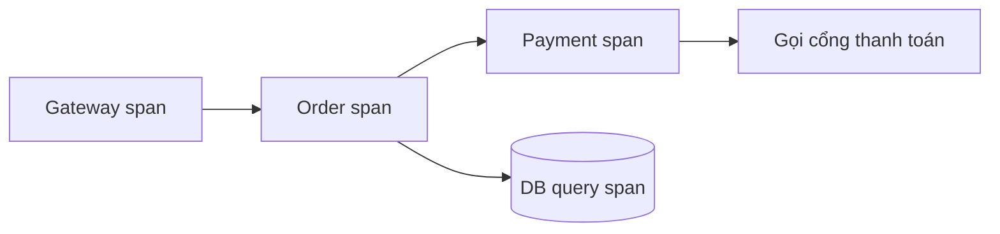

# 15 - Observability và Production

⬅️ [[14 - Microservices và Distributed Patterns]] | [[00 - Lộ trình Senior|Mục lục]] | [[16 - Docker, Kubernetes và CI-CD]] ➡️

> [!important]
> Senior không chỉ viết code chạy được mà còn **biết hệ thống đang làm gì** trên production và **trả lời được câu hỏi chưa từng nghĩ tới** khi có sự cố.

## 1. Monitoring và Observability

- **Monitoring**: theo dõi các chỉ số/cảnh báo đã biết trước ("CPU quá 80%?").
- **Observability**: khả năng **hiểu trạng thái bên trong** từ dữ liệu bên ngoài để điều tra cả những vấn đề **chưa lường trước**.

Ba trụ cột (cộng thêm profile):

| Trụ cột | Trả lời | Công cụ |
|---------|---------|---------|
| **Logs** | Chuyện gì đã xảy ra (chi tiết) | Loki, ELK/OpenSearch |
| **Metrics** | Tình trạng chung theo thời gian (số liệu) | Prometheus, Grafana |
| **Traces** | Một request đi qua những đâu, chậm ở đâu | OpenTelemetry, Tempo, Jaeger |

## 2. Metrics với Micrometer

Micrometer là lớp trừu tượng metric của Spring Boot (như SLF4J cho metric).

```xml
<dependency><groupId>io.micrometer</groupId><artifactId>micrometer-registry-prometheus</artifactId></dependency>
```

```java
@Service
class CheckoutService {
    private final Counter placed;
    private final Timer latency;

    CheckoutService(MeterRegistry reg) {
        this.placed = Counter.builder("orders.placed").tag("channel", "web").register(reg);
        this.latency = Timer.builder("checkout.latency").publishPercentileHistogram().register(reg);
    }

    void checkout() {
        latency.record(() -> { /* ... */ });
        placed.increment();
    }
}
```

Loại metric: **Counter** (chỉ tăng), **Gauge** (giá trị tức thời), **Timer/Histogram** (phân phối thời gian), **Summary**.

### Metric nên có sẵn
- **HTTP**: số request, tỷ lệ lỗi, độ trễ p50/p95/p99 (`http.server.requests`)
- **JVM**: heap, GC pause, số luồng, class loaded ([[06 - JVM, Bộ nhớ và Garbage Collection]])
- **DB pool**: kết nối đang dùng/đang chờ (`hikaricp.*`)
- **Messaging**: consumer lag, tỷ lệ lỗi ([[13 - Caching, Messaging và Resilience]])
- **Nghiệp vụ**: số đơn, thanh toán thành công/thất bại

> [!danger] Cardinality
> Đừng gắn nhãn (tag) có **vô số giá trị** (userId, orderId, URL thô) vào metric: làm nổ bộ nhớ Prometheus. Dùng nhãn có giá trị hữu hạn (route mẫu `/orders/{id}`, status, method).

### Độ trễ: nhìn percentile, không nhìn trung bình
Trung bình che giấu đuôi chậm. Theo dõi **p95/p99**; 1% request chậm với hệ thống có nhiều dịch vụ thành rất nhiều người dùng chịu ảnh hưởng.

## 3. Logging có cấu trúc

```yaml
logging:
  structured:
    format:
      console: ecs        # Spring Boot 3.4+: ecs, logstash, gelf
```

- Log **JSON**, mỗi dòng một sự kiện, có trường: `timestamp`, `level`, `service`, `traceId`, `spanId`, `userId` (nếu phù hợp)
- **MDC** gắn ngữ cảnh vào mọi dòng log của request
- **Một lần ở biên**, không log lặp ở mọi tầng; không log dữ liệu nhạy cảm
- Mức log điều chỉnh lúc chạy qua `/actuator/loggers`
- Sampling/giới hạn để tránh log tràn làm tốn chi phí và chậm hệ thống

```java
MDC.put("orderId", String.valueOf(id));
try { /* xử lý */ } finally { MDC.clear(); }      // dọn để tránh rò sang luồng khác
```

## 4. Distributed Tracing

- **Trace** = toàn bộ hành trình một request; gồm nhiều **span** (mỗi thao tác: HTTP, truy vấn DB, gọi Kafka).
- **Trace context** (header `traceparent` theo W3C) được truyền qua các dịch vụ.



Spring Boot 3 dùng Micrometer Tracing với **OpenTelemetry**:

```xml
<dependency><groupId>io.micrometer</groupId><artifactId>micrometer-tracing-bridge-otel</artifactId></dependency>
<dependency><groupId>io.opentelemetry</groupId><artifactId>opentelemetry-exporter-otlp</artifactId></dependency>
```

```yaml
management:
  tracing:
    sampling:
      probability: 0.1       # production: lấy mẫu, đừng 100% nếu lưu lượng lớn
  otlp:
    tracing:
      endpoint: http://otel-collector:4318/v1/traces
```

Gắn `traceId` vào log để từ một lỗi nhảy sang trace và ngược lại. Với **OpenTelemetry Java agent** có thể instrument tự động không cần sửa code.

## 5. SLI, SLO, SLA và Error Budget

| Thuật ngữ | Nghĩa | Ví dụ |
|-----------|-------|-------|
| **SLI** | Chỉ số đo chất lượng | Tỷ lệ request thành công; p99 độ trễ |
| **SLO** | Mục tiêu nội bộ cho SLI | 99,9% request thành công trong 30 ngày |
| **SLA** | Cam kết với khách hàng (có chế tài) | 99,5% |
| **Error budget** | Phần lỗi được phép = 100% − SLO | 0,1% ≈ 43 phút/tháng |

Dùng error budget để **cân bằng tốc độ phát hành và độ ổn định**: hết budget thì tập trung vào độ tin cậy.

**Bốn tín hiệu vàng** (Google SRE): *latency, traffic, errors, saturation*. Phương pháp **RED** cho dịch vụ (Rate, Errors, Duration) và **USE** cho tài nguyên (Utilization, Saturation, Errors).

## 6. Cảnh báo (Alerting)

- Cảnh báo theo **triệu chứng ảnh hưởng người dùng** (tỷ lệ lỗi, độ trễ, SLO burn rate), không phải mọi nguyên nhân (CPU cao chưa chắc là vấn đề)
- Mỗi cảnh báo phải **hành động được** và có **runbook**; cảnh báo ồn ào bị bỏ qua (alert fatigue)
- Phân cấp: page (đánh thức người) khác ticket (làm trong giờ)

## 7. Health check và graceful shutdown

```yaml
management:
  endpoint:
    health:
      probes:
        enabled: true
server:
  shutdown: graceful
```

- **Liveness**: tiến trình còn sống? (sai → K8s khởi động lại). **Đừng** cho liveness phụ thuộc DB/dịch vụ ngoài.
- **Readiness**: sẵn sàng nhận traffic? (sai → rút khỏi load balancer).
- **Startup probe** cho ứng dụng khởi động chậm.
- Graceful shutdown: ngừng nhận request mới, hoàn tất request đang chạy, đóng pool/consumer; đặt `terminationGracePeriodSeconds` đủ lớn trong K8s ([[16 - Docker, Kubernetes và CI-CD]]).

## 8. Triển khai an toàn

| Kỹ thuật | Ý tưởng |
|----------|---------|
| **Rolling update** | Thay dần từng instance |
| **Blue-Green** | Hai môi trường song song, chuyển traffic một lần |
| **Canary** | Cho một phần nhỏ traffic dùng bản mới, theo dõi rồi mở rộng |
| **Feature flag** | Tách *triển khai* khỏi *phát hành*, tắt nhanh khi lỗi |

Luôn có **kế hoạch rollback** và migration DB tương thích hai chiều ([[10 - JPA, Hibernate, SQL và Transaction]]).

## 9. Xử lý sự cố (Incident)

1. **Giảm thiểu tác động trước**, tìm nguyên nhân gốc sau (rollback, tắt feature flag, mở rộng)
2. Khoanh vùng bằng dashboard → trace → log → thread/heap dump
3. Giao tiếp rõ ràng (kênh sự cố, người điều phối)
4. **Postmortem không đổ lỗi**: dòng thời gian, nguyên nhân gốc, hành động khắc phục có người chịu trách nhiệm

## 10. Checklist "sẵn sàng production"

- [ ] Health/readiness/liveness, graceful shutdown
- [ ] Metric RED/USE, dashboard, cảnh báo theo SLO
- [ ] Log JSON có `traceId`, không lộ dữ liệu nhạy cảm
- [ ] Tracing xuyên dịch vụ, có lấy mẫu
- [ ] Timeout, retry, circuit breaker cho mọi phụ thuộc
- [ ] Cấu hình/bí mật ngoài code, có giới hạn tài nguyên
- [ ] Backup và đã **thử khôi phục**; có runbook
- [ ] Kế hoạch rollback, triển khai canary/blue-green
- [ ] Kiểm thử tải trước khi ra mắt ([[18 - Performance và Troubleshooting]])

> [!question] Tự kiểm tra
> 1. Observability khác monitoring ở điểm nào? Ba trụ cột trả lời câu hỏi gì?
> 2. Vì sao nhìn p99 thay vì trung bình? Cardinality là gì và vì sao nguy hiểm?
> 3. Liveness và readiness: cái nào không nên phụ thuộc DB? Vì sao?
> 4. SLO 99,9% cho phép bao nhiêu thời gian lỗi mỗi tháng? Error budget dùng để làm gì?
> 5. Mô tả cách bạn lần từ một cảnh báo tỷ lệ lỗi tăng tới nguyên nhân gốc.

⬅️ [[14 - Microservices và Distributed Patterns]] | [[00 - Lộ trình Senior|Mục lục]] | [[16 - Docker, Kubernetes và CI-CD]] ➡️
