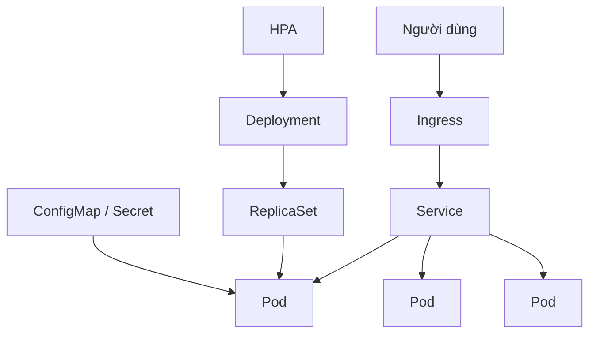
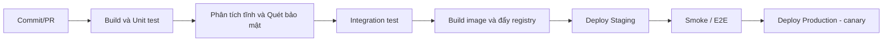

# 16 - Docker, Kubernetes và CI/CD

⬅️ [[15 - Observability và Production]] | [[00 - Lộ trình Senior|Mục lục]] | [[17 - Kiến trúc và System Design]] ➡️

## 1. Docker cho ứng dụng Java

### Dockerfile đa tầng, an toàn

```dockerfile
# --- build ---
FROM eclipse-temurin:21-jdk AS build
WORKDIR /app
COPY .mvn .mvn
COPY mvnw pom.xml ./
RUN ./mvnw -q dependency:go-offline          # cache dependency thành một lớp riêng
COPY src src
RUN ./mvnw -q clean package -DskipTests
RUN java -Djarmode=tools -jar target/*.jar extract --layers --destination extracted

# --- runtime ---
FROM eclipse-temurin:21-jre
WORKDIR /app
RUN useradd --system --uid 10001 appuser
COPY --from=build /app/extracted/dependencies/ ./
COPY --from=build /app/extracted/spring-boot-loader/ ./
COPY --from=build /app/extracted/snapshot-dependencies/ ./
COPY --from=build /app/extracted/application/ ./
USER appuser                                  # KHÔNG chạy bằng root
EXPOSE 8080
ENTRYPOINT ["java", "-XX:MaxRAMPercentage=75", "-jar", "app.jar"]
```

Nguyên tắc:
- **Multi-stage**: image cuối chỉ chứa JRE và ứng dụng
- Dùng **layered jar** để các lớp ít đổi (dependency) được cache
- Chạy bằng **user không phải root**, image nền nhỏ và được cập nhật (distroless/temurin-jre)
- Không đưa bí mật vào image; cố định phiên bản tag (tránh `latest`)
- Quét lỗ hổng image (Trivy, Grype)
- Nhanh gọn: `./mvnw spring-boot:build-image` (Buildpacks) hoặc **Jib** (không cần Docker daemon)

### Docker Compose cho môi trường dev

```yaml
services:
  db:
    image: postgres:16
    environment: { POSTGRES_DB: shop, POSTGRES_USER: app, POSTGRES_PASSWORD: secret }
    ports: ["5432:5432"]
    healthcheck:
      test: ["CMD-SHELL", "pg_isready -U app"]
  redis:
    image: redis:7
  app:
    build: .
    depends_on:
      db: { condition: service_healthy }
    environment:
      SPRING_DATASOURCE_URL: jdbc:postgresql://db:5432/shop
```

## 2. Container và bộ nhớ JVM

JVM hiện đại nhận biết giới hạn container, nhưng cần cấu hình đúng ([[06 - JVM, Bộ nhớ và Garbage Collection]]):

- `-XX:MaxRAMPercentage=70-75` thay vì `-Xmx` cứng
- Heap chỉ là một phần bộ nhớ: còn Metaspace, stack, direct memory, code cache. Pod bị **OOMKilled** khi tổng vượt `limit`.
- CPU limit thấp làm JVM thấy ít core → số luồng GC/JIT nhỏ, khởi động chậm. Cân nhắc đặt `requests` hợp lý, hạn chế `limits` CPU quá chặt.

## 3. Kubernetes cốt lõi



| Đối tượng | Vai trò |
|-----------|---------|
| **Pod** | Đơn vị chạy nhỏ nhất (một hay vài container) |
| **Deployment** | Quản lý số bản sao, rolling update, rollback |
| **Service** | Địa chỉ ổn định + cân bằng tải đến các Pod |
| **Ingress / Gateway API** | Định tuyến HTTP từ ngoài vào |
| **ConfigMap / Secret** | Cấu hình / bí mật |
| **HPA** | Tự co giãn theo CPU/metric tùy biến |
| **StatefulSet** | Ứng dụng có trạng thái (DB) |
| **Job / CronJob** | Tác vụ chạy một lần / định kỳ |
| **Namespace** | Tách biệt môi trường/team |

### Manifest mẫu cho Spring Boot

```yaml
apiVersion: apps/v1
kind: Deployment
metadata:
  name: order-service
spec:
  replicas: 3
  strategy:
    rollingUpdate: { maxSurge: 1, maxUnavailable: 0 }
  selector:
    matchLabels: { app: order-service }
  template:
    metadata:
      labels: { app: order-service }
    spec:
      terminationGracePeriodSeconds: 45
      containers:
        - name: app
          image: registry.example.com/order-service:1.4.2
          ports: [{ containerPort: 8080 }]
          env:
            - name: SPRING_PROFILES_ACTIVE
              value: prod
            - name: DB_PASSWORD
              valueFrom: { secretKeyRef: { name: order-db, key: password } }
          resources:
            requests: { cpu: "500m", memory: "768Mi" }
            limits:   { memory: "1Gi" }
          startupProbe:
            httpGet: { path: /actuator/health/liveness, port: 8080 }
            failureThreshold: 30
            periodSeconds: 2
          livenessProbe:
            httpGet: { path: /actuator/health/liveness, port: 8080 }
          readinessProbe:
            httpGet: { path: /actuator/health/readiness, port: 8080 }
          lifecycle:
            preStop:
              exec: { command: ["sh", "-c", "sleep 10"] }    # chờ LB rút Pod trước khi tắt
```

Điểm cần nhớ:
- **requests** quyết định lập lịch; **limits** là trần (vượt bộ nhớ → OOMKilled, vượt CPU → bị throttle)
- `maxUnavailable: 0` + readiness probe đúng = nâng cấp không gián đoạn
- Kết hợp `server.shutdown=graceful` với `preStop` và `terminationGracePeriodSeconds` ([[15 - Observability và Production]])
- Nhiều replica: ứng dụng phải **stateless**; session/state ra Redis/DB; job định kỳ cần ShedLock hoặc CronJob
- **PodDisruptionBudget**, **anti-affinity** để chịu được bảo trì/node hỏng
- **Helm** hoặc **Kustomize** để quản lý cấu hình theo môi trường; **GitOps** (Argo CD, Flux) để trạng thái cụm lấy từ git

### Gỡ lỗi nhanh

```bash
kubectl get pods
kubectl describe pod <pod>          # sự kiện: OOMKilled, ImagePullBackOff, probe fail
kubectl logs <pod> --previous       # log của lần chạy trước (CrashLoopBackOff)
kubectl top pod
kubectl exec -it <pod> -- sh
kubectl rollout undo deployment/order-service
```

| Triệu chứng | Nguyên nhân thường gặp |
|-------------|-----------------------|
| `CrashLoopBackOff` | Ứng dụng lỗi khi khởi động, thiếu cấu hình, probe sai |
| `OOMKilled` | Vượt memory limit (heap + non-heap) |
| `ImagePullBackOff` | Sai tên/tag, thiếu quyền registry |
| `Pending` | Thiếu tài nguyên, ràng buộc lập lịch |
| Pod khởi động lại liên tục | Liveness quá gắt hoặc phụ thuộc dịch vụ ngoài |

## 4. CI/CD

### Các giai đoạn pipeline



```yaml
# .github/workflows/ci.yml (rút gọn)
name: ci
on:
  pull_request:
  push: { branches: [main] }
jobs:
  build:
    runs-on: ubuntu-latest
    steps:
      - uses: actions/checkout@v4
      - uses: actions/setup-java@v4
        with: { distribution: temurin, java-version: 21, cache: maven }
      - run: ./mvnw -B verify                      # unit + integration (Testcontainers)
      - name: Quét lỗ hổng phụ thuộc
        run: ./mvnw -B org.owasp:dependency-check-maven:check
      - name: Build image
        if: github.ref == 'refs/heads/main'
        run: ./mvnw -B spring-boot:build-image -Dspring-boot.build-image.imageName=registry.example.com/order-service:${{ github.sha }}
```

### Nguyên tắc
- **Build một lần, triển khai nhiều nơi**: cùng một artifact/image đi qua các môi trường, chỉ khác cấu hình
- Pipeline **nhanh** (cache, chạy song song); lỗi → chặn merge
- Tag image theo **commit SHA/phiên bản**, không dùng `latest` để deploy
- Phiên bản hóa ngữ nghĩa (SemVer) và changelog tự động
- **Trunk-based development** + feature flag thường hợp với CD hơn nhánh dài
- Bảo mật chuỗi cung ứng: quét phụ thuộc, ký image, SBOM, giới hạn quyền secrets của CI
- **Continuous Delivery** (luôn sẵn sàng phát hành, bấm duyệt) khác **Continuous Deployment** (tự động tới production)

## 5. Infrastructure as Code

- **Terraform/OpenTofu** hoặc Pulumi để mô tả hạ tầng (mạng, cụm K8s, DB, hàng đợi) bằng code, có review và lịch sử
- Môi trường dev/staging/prod giống nhau nhất có thể
- Quản lý bí mật: Vault, AWS Secrets Manager, External Secrets; **không** commit vào git

## 6. Bảo mật hạ tầng cơ bản

- Pod chạy non-root, `readOnlyRootFilesystem`, bỏ quyền thừa
- **NetworkPolicy** giới hạn dịch vụ nào nói chuyện với dịch vụ nào
- RBAC tối thiểu quyền; TLS mọi nơi (cert-manager)
- Cập nhật image nền và phụ thuộc thường xuyên

## 7. Checklist

- [ ] Dockerfile đa tầng, non-root, layered jar
- [ ] JVM đặt theo `MaxRAMPercentage`, hiểu OOMKilled
- [ ] Probe liveness/readiness/startup đúng, graceful shutdown phối hợp `preStop`
- [ ] `requests/limits`, HPA, PDB, nhiều replica, stateless
- [ ] Pipeline: test → quét → build image → deploy theo giai đoạn, có rollback
- [ ] Cấu hình và bí mật tách khỏi image; hạ tầng bằng code

> [!question] Tự kiểm tra
> 1. Vì sao nên dùng multi-stage build và layered jar?
> 2. Pod bị OOMKilled dù heap chưa đầy: các thành phần bộ nhớ nào khác góp phần?
> 3. Liveness, readiness, startup probe khác nhau thế nào? Điều gì xảy ra nếu liveness phụ thuộc DB?
> 4. Làm sao để rolling update không gián đoạn người dùng?
> 5. "Build once, deploy many" nghĩa là gì và vì sao quan trọng?

⬅️ [[15 - Observability và Production]] | [[00 - Lộ trình Senior|Mục lục]] | [[17 - Kiến trúc và System Design]] ➡️
