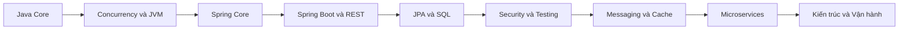

# ☕ Lộ trình Java Backend Senior

Vault này bao phủ những gì một backend engineer cần biết từ lúc bắt đầu cho tới cấp **senior**: không chỉ "dùng được" mà phải **hiểu vì sao** và **biết đánh đổi**.

> [!tip] Cách dùng trong Obsidian
> - Bấm `[[liên kết]]` để nhảy giữa các ghi chú; mở **Graph view** (`Ctrl/Cmd + G`) để xem bản đồ.
> - Liên kết màu xám là ghi chú chưa được tạo (sẽ có ở các đợt sau).
> - Tick `- [ ]` để theo dõi tiến độ. Plugin gợi ý: **Tasks**, **Dataview**, **Spaced Repetition**.
> - Mỗi ghi chú có khối `> [!question]` cuối bài: tự trả lời trước khi mở đáp án.

## Senior khác Junior ở đâu?

| Junior | Senior |
|--------|--------|
| Biết dùng API | Biết nó hoạt động bên trong thế nào |
| Làm cho chạy được | Làm cho đúng, nhanh, dễ bảo trì và dễ vận hành |
| Chọn công cụ quen thuộc | Cân nhắc đánh đổi (trade-off) và giải thích được lựa chọn |
| Sửa lỗi khi gặp | Phòng lỗi, quan sát được hệ thống, chẩn đoán nhanh khi sự cố |
| Làm một mình | Review code, dẫn dắt thiết kế, cố vấn người khác |

## 📚 Mục lục

### Phần 1: Java Core
- [[01 - Nền tảng và Java hiện đại]] ✅
- [[02 - OOP, SOLID và Design Pattern]] ✅
- [[03 - Collections và Generics chuyên sâu]] ✅
- [[04 - Stream, Exception, I-O và Date-Time]] ✅
- [[05 - Concurrency và Multithreading]] ✅
- [[06 - JVM, Bộ nhớ và Garbage Collection]] ✅

### Phần 2: Spring và Spring Boot
- [[07 - Spring Core, IoC và AOP]] ✅
- [[08 - Spring Boot nội bộ và cấu hình]] ✅
- [[09 - Spring MVC và thiết kế REST API]] ✅
- [[10 - JPA, Hibernate, SQL và Transaction]] ✅
- [[11 - Spring Security, JWT và OAuth2]] ✅
- [[12 - Testing chuyên sâu]] ✅

### Phần 3: Hệ thống phân tán và vận hành
- [[13 - Caching, Messaging và Resilience]] ⏳
- [[14 - Microservices và Distributed Patterns]] ⏳
- [[15 - Observability và Production]] ⏳
- [[16 - Docker, Kubernetes và CI-CD]] ⏳
- [[17 - Kiến trúc và System Design]] ⏳
- [[18 - Performance và Troubleshooting]] ⏳

### Phần 4: Chuẩn bị
- [[19 - Câu hỏi phỏng vấn Senior]] ⏳
- [[20 - Dự án thực hành]] ⏳
- [[21 - Tài nguyên]] ⏳

> ✅ đã có · ⏳ sẽ có ở đợt sau

## 🗺️ Lộ trình

## ✅ Tiến độ

- [ ] Java Core (01-06)
- [ ] Spring và Spring Boot (07-12)
- [ ] Hệ thống phân tán và vận hành (13-18)
- [ ] Phỏng vấn và dự án (19-21)

> [!warning] Quy tắc vàng
> Đừng chỉ đọc. Với mỗi ghi chú: **gõ lại code, phá nó cho hỏng, rồi sửa**. Kiến thức senior đến từ việc từng gặp lỗi thật.
